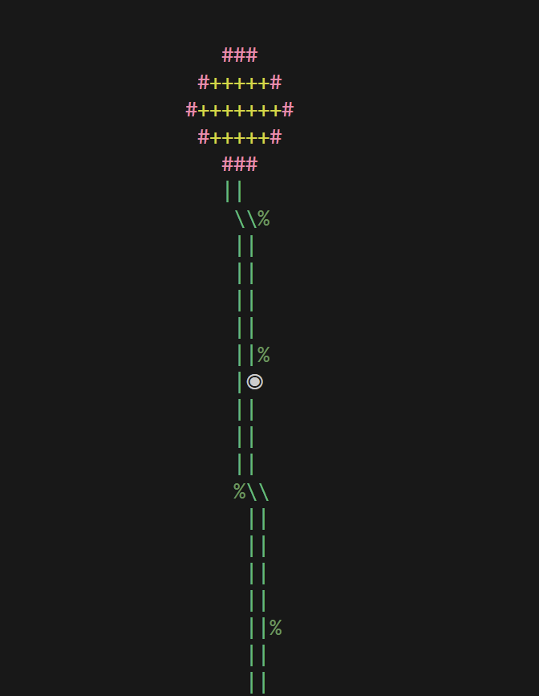

# GitGarden

<p align="center">
  
</p>

GitGarden transforms your Git commit history into a living piece of terminal art.

Every repository begins as a seed and grows alongside your project—sprouting, flowering, and eventually becoming a tree as commits accumulate.

The goal is simple: make progress visible in a way that feels alive.

---

## How It Works

GitGarden reads your repository's commit history and generates a unique plant directly in your terminal.

### Growth Stages

| Commits | Stage     |
| ------- | --------- |
| 1       | 🌱 Seed   |
| 2–20    | 🌿 Sprout |
| 21–40   | 🌸 Flower |
| 41+     | 🌳 Tree   |

Each node represents a commit. Navigate through your plant to inspect:

* Commit hash
* Author
* Date
* Commit message

---

## Features

* Interactive terminal visualization of Git history
* Navigate between commits and inspect metadata
* Procedurally generated plants — no two repositories look exactly alike
* ANSI color support
* Automatically scales with repository size
* Branch visualization
* Custom themes
* Wildlife and environmental decorations
* Contributor birds representing repository collaborators
* Export plant snapshots as images

---

<p align="center">
  
</p>

## Contributing

Contributions are welcome.

Open an issue for bugs, ideas, or feature requests. Pull requests are always appreciated, especially improvements to the ASCII art and procedural generation systems.

---

## Development

The `main` branch is stable and ready to use.

Active development and experiments take place on feature branches before being merged into `main`.

---

## Requirements

* Python 3.7+
* Git installed and available in your system `PATH`
* A terminal with ANSI color support
* pip

### Cygwin Users

```bash
python3 -m pip install --upgrade readchar
```

---

## Installation

```bash
git clone https://github.com/ezraaslan/GitGarden.git
cd GitGarden

pip install -r requirements.txt
python main.py
```

---

## Notes

* Tested on Python 3.9+
* Earlier versions may work but are not officially supported
* For the best color support on Windows, use Windows Terminal

---

Watch your repository grow, one commit at a time. 🌱🌿🌸🌳

